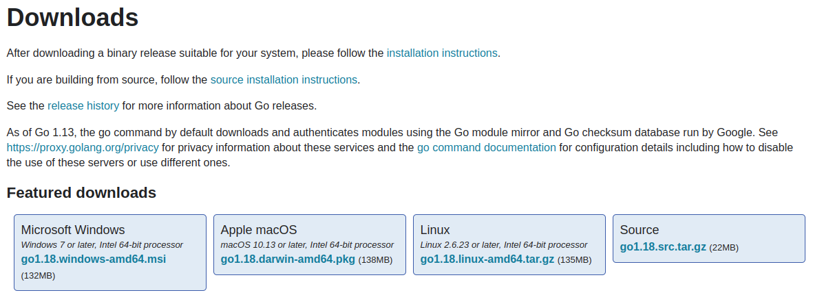
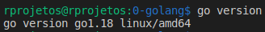
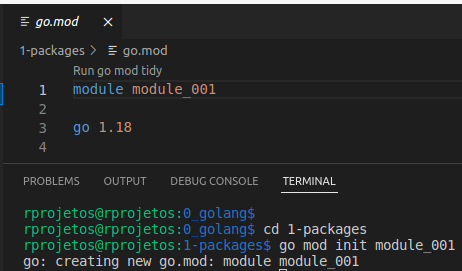
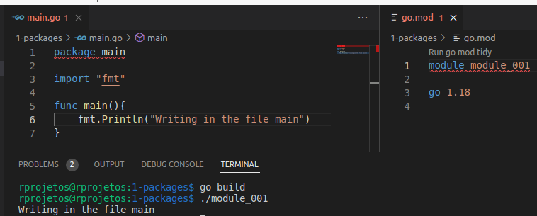

https://go.dev/

https://go.dev/dl/

https://go.dev/doc/install

Instalation test: version and environment variable

## First program in the Golang

## Create a module 

## The command build 
go build 

## External and internal functions in the internal package

## External Packages

Example:
checkmail
Golang package for email validation.

Utilization the comand:
"go get github.com/badoux/checkmail"
The package is downloaded to module_001

